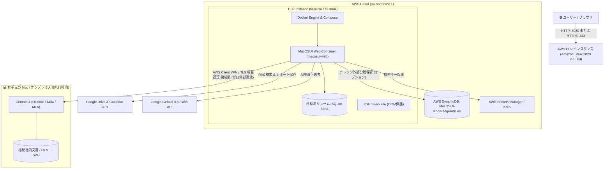
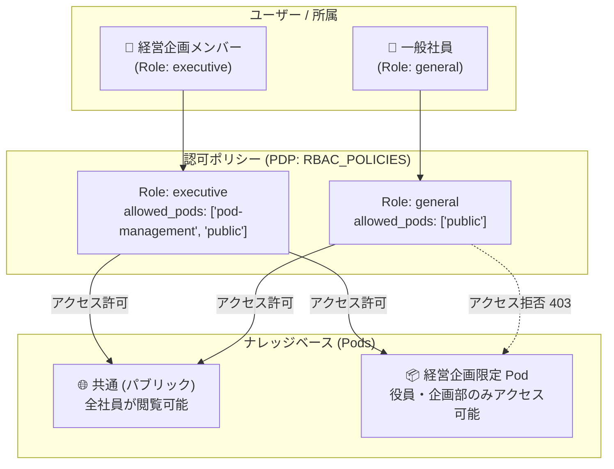

# MacOSUI - エージェント型 AI オペレーティングシステム (OSS)

MacOSUI は、人間と AI の協調作業のために設計された、オープンソース (Apache License 2.0) のプレミアムなウェブベース・オペレーティングシステムです。MacOS 風の親しみやすいインターフェースに、リサーチ、生産性向上、ナレッジベース管理のための強力な AI エージェントツールが統合されています。

---

## 🚀 主な機能とエンタープライズ特長

- **📊 AI Analytics (MCP×GenUI) ＆ ナレッジベース統合 (v2.6.0)**: チャット画面で MCP と生成 AI を活用して作成した動的ダッシュボード（HTML / Chart.js）をワンクリックでナレッジベースに保存。安全な iframe サンドボックスでナレッジベース上でも完全動作。
- **👥 Pod とロールによるアクセス制御・限定公開**: 組織やプロジェクトごとに「Pod」を作成し、ロールベースアクセス制御（RBAC / PDP・PEP）によって特定メンバーのみにナレッジを限定共有。同僚や関係者は「AI トークン消費ゼロ・待ち時間ゼロ」でダッシュボードを閲覧・活用可能。
- **🏛️ デジタル庁 行政手続等の棚卸調査（7.6万件）分析連携**: `zta-mcp-gateway v1.1.1` と連携し、全国 76,827 手続のオンライン化状況・申請件数・根拠法令を自律分析する MCP サーバー（`admin-procedures`）にネイティブ対応。
- **AWS EC2 (x86_64 / AMD & Intel) シングルインスタンス設計**: 最小限のインフラコスト（`t3.micro` / `t3.small` 1台）で高速に立ち上げ可能なシンプルかつ堅牢な Docker デプロイアーキテクチャ。
- **全自動プロビジョニング (CloudFormation & User Data)**: `cloudformation-cloudfront-ec2.yaml` をデプロイするだけで、VPC・EC2・HTTPS (CloudFront) 環境と、データ保護用の**外付けEBSボリューム**の構成・マウントまでを完全自動化。
- **🛡️ Gemma 4 Local LLM-RAG (完全社内完結 / ゼロ外部漏洩)**: 外部クラウドへ 1 バイトも機密データを送ることなく、手元の Mac / オンプレミス GPU 上の **Gemma 4 (128K Long Context / KV Cache)** を活用して社内文書や HTML/SVG 構造化ナレッジを高速推論。
- **🌐 ハイブリッド AI 接続 (AWS ⇄ ローカル Mac / Tailscale VPN)**: AWS 上の MacOSUI から、手元の Apple Silicon Mac 上で動作する Ollama / MLX (Gemma 4) に Tailscale 暗号化トンネル経由でシームレスにアクセス可能。
- **AWS DynamoDB 超低コストナレッジ分離**: ナレッジデータを AWS DynamoDB (オンデマンド/永久無料枠 25GB) に分離可能。**月額コスト 0円 〜 数十円** で永続データを高速・安全に外部分離保管。
- **ナレッジベース (Knowledge Base) Import/Export**: JSON パッケージによるナレッジデータのポータブルなインポート・エクスポートを完全サポート。
- **RAG (Gemini File Search)**: Google Drive やローカルファイルを **Gemini 3.6 Flash** 以上の File Search 機能で高速に検索・要約（安価なトークンコストで非常に高速・高精度な **Gemini 3.6 Flash** の使用を強く推奨します）。
- **Deep Research**: 自律型リサーチワークフローが詳細なレポート、インフォグラフィック、HTML を自動生成。
- **ZTA セキュリティ & メモリ Zeroization**: Agent-to-Agent (A2A) 認証、RBAC、および使用直後のメモリ即時破棄 (`keyBuffer.fill(0)`) を搭載。

---

## 💻 システム要件

| 項目 | 最低条件 | 推奨条件 (本番運用) |
| :--- | :--- | :--- |
| **デプロイ基盤** | **Single AWS EC2 (x86_64) / VPS** | Single AWS EC2 (`t3.small` / `t3a.small`) + Elastic IP / ALB |
| **CPU アーキテクチャ** | **x86_64 (AMD / Intel)** | **x86_64 (AMD / Intel)** |
| **クラウド AI モデル** | **Gemini 3.5 Flash 以上** | **Gemini 3.6 Flash (最推奨・低コスト)** / Pro |
| **ローカル AI モデル** | **Gemma 4 (Ollama / MLX)** | **Gemma 4 (Apple Silicon M2/M3/M4, 128K Context)** |
| **コンテナ構成** | 1 vCPU / 1 GB RAM (スワップ 2GB) | 2 vCPU / 2 GB RAM 以上 |
| **ライセンス** | **Apache License 2.0** | オープンソース商用利用・改変・再配布可能 |

---

## 🏗 本番インフラ・アーキテクチャ図 (Single EC2 & ハイブリッド Local AI)

本システムの標準構成（AWS EC2 ＋ Docker ＋ 手元 Mac の Gemma 4 とのハイブリッド連携）の構造図です。



---

## 🛠 デプロイメント＆構築ワークフロー

MacOSUI-oss では、用途や運用環境に合わせて以下のデプロイメントパターンを用意しています。

### Pattern A: ローカル開発・検証用 (Docker Compose)
お手元の Mac / PC で手軽に起動・検証するための構成です。ローカルのソースコードからビルドされ、DBにはSQLiteが使用されます。
1. 本リポジトリを Clone します。
   ```bash
   git clone https://github.com/Techies-T/MacOSUI-Community.git
   cd MacOSUI-Community
   ```
2. コンテナを起動します。
   ```bash
   docker compose up -d --build
   ```
3. ブラウザで `http://localhost:8080` にアクセスし、アクティベーション画面から初期設定を行います。

---

### Pattern B: AWS EC2 (x86_64 AMD/Intel) 1台構成 (CloudFormation)
最小限のコストでインターネット上に安全な本番環境を公開・運用する推奨構成です。
情報漏洩防止および Google OAuth / ZTA 規定に準拠するため、アクティベーション（初期設定）には **HTTPS 通信が必須** となっています。また、EC2の再作成時にもデータを失わないよう、**データベース（SQLite）は分離された専用のEBSボリューム**に保存されます。

以下の2つのテンプレートを用途に合わせて使い分けます。

| テンプレートファイル | HTTPS対応 | 特徴と推奨ユースケース |
| :--- | :--- | :--- |
| **`cloudformation-cloudfront-ec2.yaml`** (推奨) | ◯ (必須) | **一般ユーザー・本番推奨**。AWS が提供する `https://xxxx.cloudfront.net` で即座に HTTPS 通信・アクティベーションが可能。通信は暗号化され、セキュアに利用できます。 |
| **`cloudformation-ec2.yaml`** (非推奨) | ✕ (HTTPのみ) | **開発者・社内検証専用**。アクティベーション機能は HTTP ではブロックされるため、ソースコードを自己改変してテストするエンジニア以外は使用しないでください。 |

#### 🚀 デプロイ手順 (AWS マネジメントコンソール)

1. AWSコンソールにログインし、**CloudFormation** の画面を開きます。
2. **「スタックの作成」** ＞ 「新しいリソースを使用（標準）」をクリックします。
3. **「テンプレートファイルのアップロード」** を選び、本リポジトリ内の `cloudformation-cloudfront-ec2.yaml` をアップロードします。
4. パラメータを入力します：
   - `InstanceType`: `t3.small` などを推奨（無料枠の場合は `t3.micro`）
   - `DataVolumeSize`: データベース保存用の外付けEBS容量（デフォルト 10GB）
5. デプロイ（作成）を実行し、完了まで待機します。
6. スタックの「出力」タブに表示される `CloudFrontURL` (例: `https://d123456.cloudfront.net`) にアクセスし、アクティベーション画面から初期設定を行います。

> [!TIP]
> **データ保護（EBS分離）アーキテクチャについて**
> このCloudFormationで作成される `MacOSUI-Data-Volume` (EBS) には削除保護（`DeletionPolicy: Retain`）がかかっています。EC2インスタンスを再作成・終了してもデータはAWS上に安全に残り続けます。

---

### Pattern C: さくらのVPS / 一般 VPS 構成 (Ansible 自動構築)
AWS 以外の VPS（さくらのVPS, ConoHa, Linode 等の Debian/Ubuntu サーバー）上で運用する場合の自動構築構成です。

1. **Ansible インベントリの設定 (`ansible/inventory.ini`)**:
   対象サーバーの IP アドレスと SSH 接続ユーザーを設定します：
   ```ini
   [staging]
   133.xxx.xxx.xxx

   [staging:vars]
   ansible_user=debian
   ansible_ssh_private_key_file=~/.ssh/id_ed25519_vps
   ```
2. **Ansible Playbook の実行**:
   ```bash
   ansible-playbook -i ansible/inventory.ini ansible/setup-vps.yml
   ```
   > ※ Docker、Docker Compose、ファイアウォール（UFW: 22, 80, 443）が完全自動で構築されます。
3. **コンテナ起動**:
   対象 VPS にログインし、`docker compose up -d --build` を実行します。

---

## 🌐 AWS からローカル Gemma 4 を利用するハイブリッド接続ガイド (AWS Client VPN / エンタープライズ標準)

社外に送信できない極秘文書や、手元の Mac (Apple Silicon) 上で稼働している **Gemma 4 (Ollama / MLX)** を、AWS 上の MacOSUI から安全に利用するための手順です。
外部 SaaS を一切介さず、**AWS 公式の「AWS Client VPN」** を用いて AWS VPC と社内 Mac を相互 TLS 認証（ACM）による完全閉域網で直結します。

### ステップ 1: 相互 TLS 証明書の生成とお手元 Mac での準備
手元の Mac のターミナルで標準の `openssl` コマンドを実行し、VPN 接続用の相互 TLS 証明書（CA・サーバー・クライアント）を一括生成します：

```bash
# 1. 証明書出力ディレクトリの作成
mkdir -p ~/aws-vpn-certs && cd ~/aws-vpn-certs

# 2. 認証局 (CA) の作成
openssl genrsa -out ca.key 2048
openssl req -x509 -new -nodes -key ca.key -sha256 -days 3650 -out ca.crt -subj "/CN=AWS-VPN-CA"

# 3. サーバー証明書の作成
openssl genrsa -out server.key 2048
openssl req -new -key server.key -out server.csr -subj "/CN=server"
openssl x509 -req -in server.csr -CA ca.crt -CAkey ca.key -CAcreateserial -out server.crt -days 3650 -sha256

# 4. クライアント (Mac用) 証明書の作成
openssl genrsa -out client1.domain.tld.key 2048
openssl req -new -key client1.domain.tld.key -out client1.domain.tld.csr -subj "/CN=client1.domain.tld"
openssl x509 -req -in client1.domain.tld.csr -CA ca.crt -CAkey ca.key -CAcreateserial -out client1.domain.tld.crt -days 3650 -sha256
```

### ステップ 2: AWS Certificate Manager (ACM) への証明書インポート
AWS CLI または AWS マネジメントコンソールで、サーバー証明書とクライアント証明書を ACM にインポートします：

```bash
# サーバー証明書のインポート
aws acm import-certificate \
  --certificate fileb://~/aws-vpn-certs/server.crt \
  --private-key fileb://~/aws-vpn-certs/server.key \
  --certificate-chain fileb://~/aws-vpn-certs/ca.crt \
  --region ap-northeast-1

# クライアント証明書のインポート
aws acm import-certificate \
  --certificate fileb://~/aws-vpn-certs/client1.domain.tld.crt \
  --private-key fileb://~/aws-vpn-certs/client1.domain.tld.key \
  --certificate-chain fileb://~/aws-vpn-certs/ca.crt \
  --region ap-northeast-1
```

### ステップ 3: AWS Client VPN エンドポイントの作成
1. **AWS コンソール ＞ VPC ＞ Client VPN エンドポイント** を開きます。
2. **「Client VPN エンドポイントを作成」** をクリック：
   - **クライアント IPv4 CIDR**: `10.100.0.0/22`（VPC と重複しない CIDR）
   - **サーバー証明書 ARN**: 上記でインポートしたサーバー証明書を選択
   - **認証オプション**: 「相互認証を使用」➔ クライアント証明書 ARN を選択
   - **接続ログ**: 無効（または CloudWatch Logs を指定）
   - **VPC ID**: EC2 が存在する VPC を選択
3. 作成後、**「ターゲットネットワークの関連付け」** で EC2 のサブネットを関連付けます。
4. **「認証ルール」** で `0.0.0.0/0`（または VPC CIDR）へのアクセスを「すべてのユーザーに許可」します。
5. **「クライアント設定をダウンロード」** から `.ovpn` ファイルを取得します。

### ステップ 4: Mac 側で AWS VPN Client から接続
1. 公式の **[AWS Client VPN アプリ (macOS版)](https://aws.amazon.com/vpn/client-vpn-download/)** をダウンロード・インストールします。
2. ダウンロードした `.ovpn` ファイルの末尾に、Mac のクライアント証明書と秘密鍵を埋め込みます：
   ```text
   <cert>
   （~/aws-vpn-certs/client1.domain.tld.crt の中身）
   </cert>
   <key>
   （~/aws-vpn-certs/client1.domain.tld.key の中身）
   </key>
   ```
3. AWS VPN Client アプリでプロファイルを追加し、**「接続」** をクリックします。
4. これでお手元の Mac が AWS VPC 内の IP（例: `10.100.0.x`）を取得し、完全な閉域網で直結されます！

### ステップ 5: Ollama の起動と MacOSUI での接続設定
1. **Mac 側で Gemma 4 を起動**:
   ```bash
   OLLAMA_HOST=0.0.0.0:11434 ollama run gemma4:26b-mlx
   ```
2. **MacOSUI 画面での設定**:
   - ブラウザで AWS 上の MacOSUI（CloudFront または ALB）にアクセス。
   - **System Settings ＞ System タブ** を開く。
   - **Local AI Host URL** に `http://10.100.0.x:11434`（MacのVPN接続IP）を指定して保存。
   - チャット画面で **`🛡️ Gemma 4 Local RAG`** を選択すれば、社内文書が一切クラウドに出ることなく安全に推論されます！

---

## 🔄 既存環境のデータ完全保持・安全なアップグレード手順 (CI/CD)

MacOSUI では、ユーザーデータ・ナレッジ・暗号化キーが永続ボリューム（`./data`）に完全分離されているため、**再アクティベーションや過去データの消失なしに、プログラム（コンテナ）だけを安全にアップグレード** できます。

### 方法 1: GitHub Actions による全自動 CI/CD デプロイ (推奨)
本リポジトリを Fork して運用する場合、GitHub Actions を使って `git push`（または画面上の「Run workflow」ボタン）一発で本番 EC2 が自動バックアップ＆安全に更新されます。

#### 🔑 GitHub Secrets の事前設定手順（初回のみ・1分で完了）

1. **EC2 側でワンライナーを実行（鍵ペアの生成と登録）**:
   AWS マネジメントコンソール（または CloudShell）から対象 EC2 に接続し、以下を実行します：
   ```bash
   ssh-keygen -t ed25519 -f ~/.ssh/github_actions_ec2 -N ""
   cat ~/.ssh/github_actions_ec2.pub >> ~/.ssh/authorized_keys
   chmod 600 ~/.ssh/authorized_keys

   # 画面に表示された秘密鍵をコピー
   cat ~/.ssh/github_actions_ec2
   ```

2. **GitHub リポジトリに Secrets を登録**:
   リポジトリの **Settings ＞ Secrets and variables ＞ Actions** を開き、**「New repository secret」** から以下の **3つ** を登録します：

   | Secret 名 | 設定する値 |
   | :--- | :--- |
   | **`EC2_HOST_IP`** | 対象 EC2 インスタンスのパブリック IPv4 アドレス（例: `35.75.2.250`） |
   | **`EC2_USER`** | `ec2-user` |
   | **`EC2_SSH_PRIVATE_KEY`** | 上記ステップ1で出力された秘密鍵の全文（`-----BEGIN...` から `-----END...` まで） |

3. **自動デプロイの実行**:
   - `main` ブランチに Push するか、GitHub の **「Actions」 ＞ 「Multi-Environment Deploy」 ＞ 「Run workflow」** から `aws-ec2` を選択して実行します。
   - 既存データベースの自動バックアップ ➔ 最新コンテナの再ビルド ➔ 無停止更新が全自動で完了します。

### 方法 2: EC2 サーバー内での手動安全アップグレード (ワンライナー)
サーバーに SSH 接続して手動でアップグレードする場合も、データは 100% 安全に引き継がれます：
```bash
cd ~/MacOSUI

# 1. 最新バージョンのコードを取得
git fetch --tags
git checkout v2.5.0

# 2. 既存の DB や設定データを保持したまま、Web コンテナだけを再ビルド・再起動
docker compose up -d --build --force-recreate --no-deps web
```
> ※ 再起動後、ブラウザをリロードするだけで再アクティベーション不要でそのまま v2.5.0 を利用可能です。

---

## 🚑 トラブルシューティングガイド

EC2 やローカル環境でサイトにアクセスできない場合の解決手順です。

### 1. サーバー上のコンテナ稼働状況を確認
EC2 インスタンスに SSH 接続（またはローカルターミナル）でログインし、コンテナの状態を確認します：
```bash
docker ps
```
- `macosui-web` コンテナが `Up`（起動中）になっているか確認します。
- もし `Restarting` や停止している場合は、以下のコマンドでログを確認します：
```bash
docker logs --tail 100 macosui-web
```

### 2. ポート 8080 のセキュリティグループ確認
ブラウザで `http://<EC2-PUBLIC-IP>:8080` にアクセスできない場合、AWS セキュリティグループでポート `8080` が許可されているか確認してください。

---

## ⚙️ 事前準備とアクティベーション

初回起動時には **MacOSUI アクティベーション** 画面が表示されます。手動で `.env` ファイルを設定する必要はありませんが、以下の API 設定が **必須** となります。

### 1. Google Cloud コンソールの設定と必須 API の有効化

MacOSUI の機能（カレンダー連携・RAGナレッジ検索・DeepResearchのレポート保存など）を正しく動作させるため、Google Cloud Console で以下の **2つの API の有効化** および **OAuth 設定** が必須となります。

> [!IMPORTANT]
> **必須 API の有効化 (未有効化の場合、503 / 403 `PERMISSION_DENIED` エラーになります)**
> Google Cloud Console にアクセスし、プロジェクトを選択の上、以下の API を有効化してください：
> 1. **Google Drive API**: [Google Drive API 有効化ページ](https://console.developers.google.com/apis/api/drive.googleapis.com/overview)
>    - *用途*: RAG (File Search) のファイル同期、DeepResearch レポートの Google Drive 自動保存
> 2. **Google Calendar API**: [Google Calendar API 有効化ページ](https://console.developers.google.com/apis/api/calendar.googleapis.com/overview)
>    - *用途*: カレンダーウィジェットおよびバーチャルオフィスの予定同期・調整
> 3. **OAuth 2.0 クライアント ID**: Google ログイン認証用 (ウェブアプリケーションタイプ)

> [!IMPORTANT]
> **「テストユーザー」の追加について (Google Cloud Consoleの仕様)**
> 新規作成したOAuth同意画面は初期状態で「テスト中 (Testing)」となります。テスト中のアプリには、あらかじめ登録した「テストユーザー」しかログインできません（403 `access_denied` エラーになります）。以下の手順でご自身のアカウントを追加してください：
> 1. Google Cloud Console で対象プロジェクトを開く。
> 2. 左側のメニューから **「API とサービス」 ＞ 「OAuth 同意画面」** をクリック。
> 3. 左のメニューから **「対象 (Audience)」** タブを選択。
> 4. 画面を下へスクロールし **「テストユーザー (Test users)」** セクションを見つける。
> 5. **「+ ユーザーを追加 (ADD USERS)」** を押し、ログインさせたい `@gmail.com` 等のメールアドレスを追加して保存。

### 2. アクティベーション手順
ブラウザで `http://<あなたのサーバーIP>:8080` または `http://localhost:8080` にアクセスし、画面の指示に従って Google OAuth Client ID/Secret および Gemini API キーを入力してアクティベートします。

---

## 🔬 Deep Research ワークフロー初期設定とシステムプロンプト

MacOSUI には、自律型リサーチとナレッジ生成を自動実行する **Deep Research エンジン** が標準搭載されています。
データベース（SQLite / PostgreSQL）の初回初期化時に以下の **完全なシステムプロンプトとワークフロー定義が自動登録** されるため、手動設定なしですぐに高品質なリサーチを実行できます。

### 1. 自動登録されるデフォルトワークフローとプロンプト

| ワークフロー名 | 出力タイプ | 推奨モデル | 役割と動作 |
| :--- | :--- | :--- | :--- |
| **HTML/SVGナレッジ生成** (デフォルト) | `HTML/SVG` | **Gemini 3.6 Flash / Flash Lite** | リサーチ結果を Tailwind CSS / SVG を用いたインタラクティブな単一 Web ドキュメントとして自動生成し、Google Drive に保存 |
| **インフォグラフィック画像生成** | `Infographic` | **Gemini 3.1 Pro** | リサーチ結果の主要ポイントを整理したプロフェッショナルな画像アセット（インフォグラフィック）を出力し、Google Drive に保存 |

#### 📝 Step 1: リサーチ部 (Research Agent) の標準システムプロンプト
```text
あなたは世界最高峰のリサーチャーです。提出された社内資料（RAGファイル）と、最新のWeb検索結果（Google Search）の両方を駆使して、包括的でインサイトに富んだ長文の調査レポートを作成してください。必要に応じて、検索した結果や考察を整理し、Markdownフォーマットで見やすく構造化すること。

【重要事項】ユーザーから「ファイルに保存して」と頼まれても、あなたが直接ファイル操作やダウンロードリンクの生成をする必要はありません。あなたがチャットに出力したMarkdownのテキストは、システム側で自動的にGoogle Driveへファイルとして保存・エクスポートされる仕組みが備わっています。そのため、「ファイルとして保存できませんのでコピーしてください」などの謝罪や案案内は一切書かずに、ただ自信を持ってMarkdownレポートの本文のみを堂々と出力してください。
```

#### 🎨 Step 2: HTML/SVG 生成部 (Frontend Agent) の標準プロンプト
```text
以下のリサーチ記事内容と含まれるデータを分析し、**1つの完全なHTMLファイル**を作成してください。
Tailwind CSSのCDNを利用してモダンなデザインにし、純粋なHTML文字列のみを返してください。

=== テーマ: {{title}} ===

{{report}}
```

#### 🖼️ Step 2: インフォグラフィック生成部 (Infographic Agent) の標準プロンプト
```text
以下のレポート内容を完璧に表現した、プロフェッショナルなインフォグラフィックを1枚生成してください。

=== レポート内容 ===

{{report}}
```

### 2. Google Drive 保存先フォルダとモデルの設定方法

リサーチ結果や生成された HTML / 画像を Google Drive に自動保存したい場合は、以下の手順で保存先フォルダを設定します：

1. **Google Drive 側の準備**:
   - ご自身の Google Drive で保存用フォルダ（例: `MacOSUI_Research`）を新規作成します。
   - ブラウザのアドレスバーの URL（`https://drive.google.com/drive/folders/【この部分の英数字】`）から **フォルダID** をコピーします。
2. **MacOSUI 画面での設定**:
   - 画面左上の Apple メニュー（または Dock）から **「System Settings」 ＞ 「Deep Research」タブ** を開きます。
   - **Google Drive 保存先 Folder ID** にコピーしたフォルダIDを貼り付けて保存します。
   - **モデルの選択**:
     - 基本チャット・RAG: **Gemini 3.6 Flash** (低コスト・高速)
     - リサーチ推論・画像生成: **Gemini 3.1 Pro** または **Gemini 3.6 Flash**

---

## 📊 AI Analytics & Pod ナレッジ共有・アクセス制御ガイド (v2.6.0 新機能)

MacOSUI v2.6.0 では、MCP 経由で取得した大規模データと生成 AI を組み合わせた動的ダッシュボード（**AI Analytics**）の作成、ナレッジベース保存、および組織内でのセキュアな **Pod 共有** に対応しました。

### 1. AI Analytics（MCP × GenUI）とワンクリック保存
- チャット画面（`McpChat` / `Gemini`）で MCP ツールを用いてデータを取得・集計し、Tailwind CSS や Chart.js を用いたリッチなダッシュボードを自動生成できます。
- 生成されたダッシュボードのヘッダー右上にある **[📚 ナレッジに保存]** ボタンをクリックするだけで、タイトルや保存先 Pod、タグを指定して即座にナレッジベースへ蓄積できます。

### 2. ナレッジベース画面での「動的プレビュー（安全な iframe サンドボックス）」
- ナレッジベース（`KnowledgeBase`）で記事を選択すると、保存された動的ダッシュボードが **安全な iframe サンドボックス** 内でそのまま動的にレンダリングされます。
- Chart.js によるグラフ描画はもちろん、**棒グラフクリックによる詳細カードの更新や動的フィルタリングなど、JavaScript の双方向インタラクションが 100% 稼働** します。
- `[🖥️ インタラクティブ (GenUI)]` と `[📝 ソース / Markdown]` の切り替え、`[↗️ 別タブで開く]`、`[🗖 全幅表示]` ツールバーを完備しています。

---

### 👥 Pod とロールを使ったナレッジの「限定公開」方法

社内の特定部署（例: 経営企画、人事、営業、デジ庁プロジェクトチーム）専用のナレッジ空間を作り、関係者のみに閲覧を限定する（Zero Trust / PDP・PEP 準拠）設定手順です。



#### 🌐 パブリック公開 vs 📦 Pod 限定公開
- **🌐 共通（パブリック）**: 全社員・全ログインユーザーが閲覧可能な共有ナレッジ。社内ポータルや共通マニュアル向け。
- **📦 特定 Pod（限定公開）**: その Pod ID が許可されているロールのメンバーのみが一覧表示・プレビューできる隔離された空間。

#### 🛠️ 限定公開の設定ステップ (4ステップ)

1. **Pod の作成**:
   - ナレッジベース画面の Pod 一覧、またはデータベース（`db_sqlite.cjs` / `db_postgres.cjs`）に新しい Pod を登録します。
   ```sql
   INSERT INTO pods (id, name, description) VALUES ('pod-management', '経営企画部限定', '役員および企画メンバー専用の分析ナレッジ空間');
   ```
2. **ロールポリシー（`RBAC_POLICIES`）での Pod アクセス許可**:
   - システム設定のロール管理画面（または DB 設定）で、対象ロール（例: `executive`）の `allowed_pods` に上記 Pod ID を追加します。
   - 一般社員ロール（`general`）の `allowed_pods` に該当 Pod が含まれていなければ、一覧取得 API（`GET /api/knowledge`）および詳細取得 API（`GET /api/knowledge/:id`）で厳格に認可評価（PEP）され、データは返却されません。
3. **対象ユーザーへのロール割り当て**:
   - テナント管理画面（ユーザー管理）から、対象メンバーに `executive` ロールを付与します。
4. **ダッシュボード・記事の Pod 紐付け保存**:
   - チャットで [📚 ナレッジに保存] をクリックした際、保存先ドロップダウンで「📦 経営企画部限定」を選択して保存します。
   - これにより、該当ロールを持つメンバーのみが「**AI トークン消費ゼロ・待ち時間ゼロ（瞬時表示）**」で動的ダッシュボードを安全に閲覧・活用できます！

---

### 🏛️ デジタル庁 行政手続分析 MCP ＆ ZTA MCP Gateway v1.1.1 連携手順

全国 76,827 手続の棚卸調査データ（オンライン化率、年間申請件数、ライフイベント分類、手数料、根拠法令等）を AI が分析し、行政改革ダッシュボードを自律生成するための環境構築手順です。

> [!IMPORTANT]
> **前提条件**: 本機能には **`zta-mcp-gateway v1.1.1` 以上** が必須となります。

#### 🚀 起動と利用手順

1. **zta-mcp-gateway (v1.1.1) の起動**:
   ```bash
   git clone https://github.com/Techies-T/zta-mcp-gateway.git
   cd zta-mcp-gateway
   git checkout v1.1.1
   docker compose up -d --build
   ```
   ※ ポート `8085` でゲートウェイが起動し、デジタル庁行政手続データ（`admin-procedures`）が利用可能になります。

2. **MacOSUI の起動**:
   ```bash
   cd MacOSUI-Community  # または MacOSUI-oss
   docker compose up -d --build
   ```
   ※ 起動時に `http://host.docker.internal:8085/mcp/admin-procedures/sse` へ自動接続され、4つの分析ツールがロードされます。

3. **同梱サンプルの確認と活用**:
   - ナレッジベースを開き、初期 Pod「**📦 デジ庁データ分析**」を選択すると、同梱されたサンプル記事「**行政手続 ライフイベント別デジタル化＆行政改革ダッシュボード**」を即座に動的プレビューできます。
   - チャット（`McpChat`）で「引越し・出生関連で年間申請件数が多く、オンライン化が遅れている手続トップ10をダッシュボードにして」とプロンプトを投げるだけで、最新の分析ウィジェットが生成され、ワンクリックで Pod に保存できます。

---

### 🔐 セキュリティ・通信暗号化 (HTTPS / HTTP) と ZTA 規定

MacOSUI では、Zero Trust Architecture (ZTA) の原則（「ネットワーク境界を信頼せず、すべての通信を暗号化・検証せよ」）に基づき、以下の通信暗号化方針を定めています：

1. **環境ごとの HTTPS / HTTP 通信規定**:
   - **AWS EC2 / 本番サーバー構成**: 本番ドメイン運用においては、パブリックネットワーク上での盗聴・中間者攻撃 (MitM) やセッションハイジャックを防ぐため、Nginx + Let's Encrypt や ALB / Cloudflare を前段に配置した HTTPS 暗号化通信を強く推奨します。
   - **ローカル開発環境 (`localhost` / `127.0.0.1`)**: 手元でのクイックな動作検証のため HTTP (`http://localhost:8080`) での動作を許可しています。

2. **認証クッキー (`Secure` 属性) の動的コントロール**:
   - セッション認証クッキー (`token`) の `Secure` 属性（HTTPS限定送信フラグ）は、通信プロトコルを動的に判定します。
   - `HTTPS` 通信時は自動的に `Secure` 属性が有効化され、`HTTP (localhost)` 通信時のみブラウザ側でクッキーが拒否されないよう柔軟にコントロールされるため、開発環境でもセッションが切れずにスムーズに動作します。

3. **データベースの暗号化と自動キー生成 (`DB_ENCRYPTION_KEY`)**:
   - Gemini API キーや Google OAuth Client Secret などの機密設定値は、データベース（SQLite / PostgreSQL）内で **AES-256-GCM により暗号化** されて保存されます。
   - 暗号化キー (`DB_ENCRYPTION_KEY`) は、初回起動時にプログラムが全自動で生成し、永続ボリューム (`data/development.env`) に安全に保存するため、ユーザーが手動で暗号キーを発行・管理する手間は一切ありません。

---

## 📄 ライセンス
[Apache License 2.0](LICENSE) - 商用利用、改変、再配布、および個別カスタマイズが自由に行えます。
