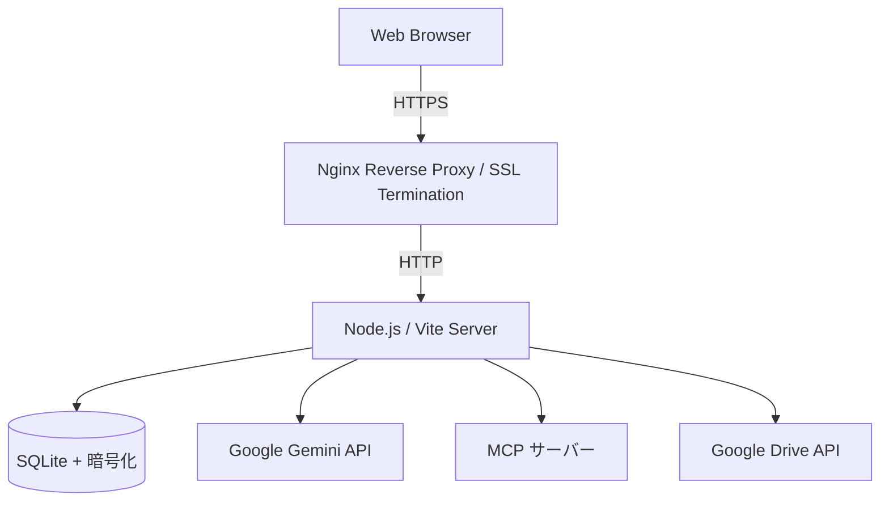

# MacOSUI - エージェント型 AI オペレーティングシステム

MacOSUI は、人間と AI の協調作業のために設計された、プレミアムなウェブベースのオペレーティングシステムです。MacOS 風の親しみやすいインターフェースに、リサーチ、生産性向上、バーチャルオフィス管理のための強力な AI ツールが統合されています。

## 🚀 主な機能

- **RAG (Gemini File Search)**: Google Drive やローカルファイルを Gemini 3.5 Flash 以上の File Search 機能で高速に検索・要約。大規模なドキュメントベースとの対話を可能にします。
- **Deep Research**: 自律型リサーチワークフローが詳細なレポート、インフォグラフィック、インタラクティブな HTML を生成。
- **バーチャルオフィス**: AI による勤怠管理と会議の自動調整機能を備えた空間型コラボレーションツール。
- **マルチ MCP マネジメント**: 複数の MCP（Model Context Protocol）サーバーを統合・管理。カレンダー、ファイル、外部 API など、多様なデータソースをエージェントから自在に操作。
- **ZTA セキュリティ**: Agent-to-Agent (A2A) 認証と詳細な RBAC を備えたゼロトラストアーキテクチャ。
- **Antigravity Agent**: Antigravity 2.0 の機能をフル活用し、Gemini 3.5 Flash 以上の高度な推論による自律エージェントのオーケストレーションを管理。

## 💻 システム要件

| 項目 | 最低条件 | 推奨条件 |
| :--- | :--- | :--- |
| **AI モデル** | **Gemini 3.5 Flash 以上** | Gemini 3.5 Flash / Pro |
| **CPU** | 1 vCPU | 2 vCPU 以上 |
| **メモリ** | 2 GB RAM | 4 GB RAM 以上 |
| **ストレージ** | 10 GB SSD | 20 GB SSD 以上 |
| **OS** | Linux (Ubuntu/Debian) | Docker 対応の Linux |

## 🛠 インストール方法

### オプション A: さくら VPS / 一般的な Linux (Docker Compose)
単一の仮想サーバーで最も素早く開始できる方法です。

1.  **リポジトリのクローン**:
    ```bash
    git clone https://github.com/Techies-T/MacOSUI-oss.git
    cd MacOSUI-oss
    ```
2.  **Docker Compose で起動**:
    ```bash
    docker compose up -d
    ```
3.  **アクティベーション**: `https://<あなたのドメイン>` にアクセスし、画面上の指示に従ってセットアップを行ってください。
    - ※ ローカルテスト等でドメインがない場合のみ `http://<サーバーのIP>:8080` を使用しますが、企業利用では HTTPS の利用を強く推奨します。

### オプション B: AWS ECS (Fargate)
高可用性とスケーラビリティが必要な、エンタープライズ向けの展開方法です。

1.  **ECR のセットアップ**:
    - Amazon ECR で `macosui` という名前のプライベートリポジトリを作成します。
2.  **デプロイ**: `main` ブランチにプッシュすると、`deploy-ecs.yml` ワークフローが自動的に実行されます。
    - ※ 本番運用では ALB + ACM による HTTPS 化を強く推奨します。

### オプション C: AWS EC2 (Route 53 + Let's Encrypt) 【推奨・セキュアテスト】
独自のドメインを使い、ALB を介さずに低コストで HTTPS 環境を構築する方法です。

1.  **事前準備**: Route 53 で管理しているドメインと、EC2 用の IAM ロールを用意します。
2.  **自動セットアップ**: インスタンスにログインし、以下のスクリプトを実行するだけで HTTPS サイトが立ち上がります。
    ```bash
    sudo ./scripts/setup-ec2-ssl.sh <ドメイン名> <ホストゾーンID> <メールアドレス>
    ```
    - 詳細な手順は [aws_ec2_deployment_guide.md](file:///Users/minoru_inui/.gemini/antigravity/brain/afcc0f69-b779-4b30-9a3b-5206cd54db89/aws_ec2_deployment_guide.md) を参照してください。

## ⚙️ 事前準備とアクティベーション

初回起動時には **MacOSUI アクティベーション** 画面が表示されます。手動で `.env` ファイルを設定する必要はありませんが、以下の API 設定が **必須** となります。

### 1. Google Cloud コンソールの設定
以下の API を有効にした Google Cloud プロジェクトと OAuth クレデンシャルが必要です：
- **Google Calendar API**: バーチャルオフィスの予定調整に使用。
- **Google Drive API**: RAG（File Search）機能で使用。
- **OAuth 2.0 クライアント ID**: 認証に使用。

### 2. アクティベーション手順
ブラウザで `https://<あなたのドメイン>` または `http://localhost:8080` にアクセスし、以下の情報を入力します：
1.  **管理者メールアドレス**: 最初の管理者として登録するメールアドレス。
2.  **Google OAuth 情報**: Client ID と Client Secret。
3.  **Gemini API**: Google AI Studio (Gemini 3.5 Flash 以上が必要)。
4.  **暗号化キー**: データベース内のトークン保護用（自動生成可能）。

## 🏗 アーキテクチャ



## 📄 ライセンス
Private / Proprietary. Designed by Team Antigravity.
