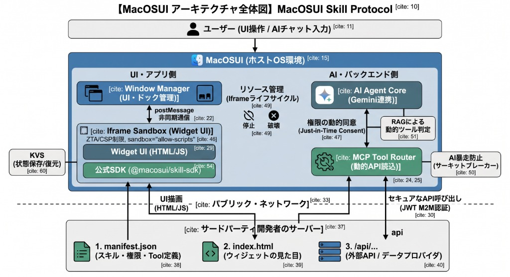

# インセプションデッキ：MacOSUI Skill Protocol (開発マニフェスト)

本プロジェクト「MacOSUI Skill Protocol」の根幹となる開発方針・設計原則を以下に定めます。これは今後のすべての実装（ウィジェット、通信、AIツール）における「北極星（North Star）」として機能します。

## 1. コアバリュー：MacOSUIの基本概念の維持
- **「ウィジェット＝AI Agent」の思想**: ウィジェットは単なる情報を表示する板ではなく、自律的に考え、行動し、ユーザーを支援するAI Agentの「視覚的なインターフェース（顔）」であるという概念を崩しません。
- **一貫したUX**: 外部のSkillであっても、MacOSUIのデスクトップエコシステム（ウィンドウ管理、ドック、通知）に自然に溶け込むように統合します。

## 2. エコシステムの開放：サードパーティ開発の民主化
- **外部開発の容易性 (Developer Experience)**: 他社や個人の開発者が、MacOSUI本体の複雑なReactビルド環境に依存せず、使い慣れた技術（HTML/JS、Vue、Svelte等）で自由にウィジェットを開発・ホストできるようにします。
- **URLベースのシームレスなインストール**: アプリストアの審査待ちや複雑なパッケージ管理を排し、マニフェストファイル (`skill.json`) のURLを1つ入力するだけで、即座にMacOSUIへ統合（インストール）できる仕組みを提供します。

## 3. セキュリティファースト：ZTAとM2M認証の徹底
- **Zero Trust Architecture (ZTA) の適用**: MacOSUI本体と外部ウィジェット（およびそのバックエンドAPI）間の通信は、ローカル環境であろうと「常に信頼できないネットワーク」とみなし、明示的な検証と認可を行います。
- **強固な M2M 認証**: 外部API呼び出しには「JWT（JSON Web Token）ベースの署名付きリクエスト」を義務付け、改ざんやなりすましを防止します。
- **最小権限の原則 (Least Privilege)**: インストール時に明示的な同意（Consent）を求め、各ウィジェットには必要最小限の権限（スコープ）のみを付与し、サンドボックス（Iframe）によってMacOSUIのコアリソースを隔離します。

## 4. 拡張性と相互運用性：MCPの統合
- **Model Context Protocol (MCP) の概念統合**: ウィジェット（UI）だけでなく、AIモデルに「機能（Tools）」を提供する標準化されたインターフェースを採用し、他のプラットフォームのエージェント技術とも将来的に連携しやすい設計とします。
- **疎結合な設計 (Separation of Concerns)**: UIのレンダリングはウィジェット側が責任を持ち、AI推論・認証・システム連携はMacOSUI（ホスト側）が責任を持つ、完全な疎結合アーキテクチャを実現します。

---

# AI Skill（プラグイン）型ウィジェット構想の調査・アドバイス

現在MacOSUIの内部に組み込まれている「ウィジェット」や「アプリ」を外出しし、**「誰もがサードパーティとして開発・配布でき、ユーザーが自由にインストールできる」**仕組みにするというアイデアは、非常に未来的で拡張性の高い素晴らしいアプローチです！

これは、昨今の**AI Agentアーキテクチャ**と**Webのサンドボックス技術**を組み合わせることで十分に実現可能です。以下に、どのように実現できるか、そのアーキテクチャの青写真（ドラフト）とアドバイスをまとめました。

---

## 1. 提案するアーキテクチャ：「MacOSUI Skill Protocol」

サードパーティの開発者は、MacOSUI本体のソースコード（Reactなど）を一切触ることなく、自身のサーバー（VercelやCloudflareなど）に**「UI」**と**「API」**をホストし、それらをMacOSUIに連携させます。

### 構成要素
1. **Skill Manifest (マニフェストファイル)**
   開発者は `skill.json` という設定ファイルを公開します。ユーザーはこのURLをMacOSUIの「Settings」に入力するだけでインストールが完了します。
2. **Widget UI (Iframe サンドボックス)**
   MacOSUIは、マニフェストに記載されたURLを `<iframe sandbox="allow-scripts allow-same-origin allow-forms">` としてデスクトップ上にレンダリングします。これにより、Reactの複雑なビルドに依存せず、かつセキュリティ（XSS対策）を保ったまま外部アプリを動かせます。
3. **AI Tools (関数呼び出し / Function Calling)**
   マニフェストには、そのSkillが提供する「AI用のツール（APIエンドポイント）」が定義されます。MacOSUIのバックエンドはこれを読み取り、Geminiに `functionDeclarations` として動的にアタッチします。

---

## 2. システムの動作フロー（例：外部開発者が作った「お天気Skill」）

### 【開発者の作業】
開発者は自身のサーバーに以下の3つをデプロイします。
1. `skill.json` (Skillの名前、アイコン、ツールの定義など)
2. `index.html` (ウィジェットの見た目。グラフ表示など)
3. `/api/weather` (実際の天気データを返すAPI)

### 【MacOSUI側の挙動】
1. **インストール**: ユーザーが `https://dev-server.com/skill.json` を入力してインストール。
2. **チャット連携**: ユーザーがGemini Chatで「明日の天気を教えて」と聞くと、Geminiは「お天気Skill」のツールが存在することに気づき、MacOSUI経由で外部の `/api/weather` にアクセスしてデータを取得し、回答します。
3. **ウィジェット連携**: ユーザーがデスクトップでお天気ウィジェットを開くと、`index.html` がIframeで表示されます。Iframe内のJSは `window.postMessage` を使ってMacOSUI本体と通信し、「MacOSUIのAIを使って、この天気を要約して！」といった依頼を投げることができます。

---

## 3. 実現に向けた技術的な課題と解決策

### ① セキュリティと分離 (Isolation)
外部の誰かが作ったコードをMacOSUI上で動かすため、悪意のあるスクリプトからシステムを守る必要があります。
* **解決策**: Reactコンポーネントとして動的にインポート（Module Federation等）するのではなく、**Iframe（`sandbox` 属性付き）** を採用します。Chrome拡張機能やFigmaプラグインもこの方式を採用しており、最も安全で枯れた技術です。

### ② AIエンジン（バックエンド）の拡張
以前の検証でMCP（Model Context Protocol）を試されたかと思いますが、あの思想に近いものです。
* **解決策**: MacOSUIのバックエンド（`server/index.cjs`）を少し改修し、DBに保存された「インストール済みSkill」のJSONから動的に `tools` 配列を組み立ててGemini APIに送信する「プラグイン・ローダー」を実装します。

### ③ ホストとウィジェットの通信
Iframeの中にあるウィジェットが、MacOSUI本体の設定（ダークモード情報など）やAIモデルを使いたい場合、どうやって通信するかが鍵です。
* **解決策**: `postMessage` APIを用いた非同期通信ブリッジを作成します。MacOSUIが親となり、子（Iframe）からのリクエスト（例: `type: "REQUEST_AI_GENERATION", prompt: "..."`）を受け取って処理し、結果を返すSDKのような薄いJSライブラリを提供します。

---

## 4. 総評とアドバイス

この仕組み（エコシステム化）を実現できれば、MacOSUIは単なる「デスクトップ型UI」から、**「AIエージェントのプラットフォーム（OS）」**へと進化します。世界中の開発者がMacOSUI用のSkill（ウィジェット）を開発する「App Store」のような未来も描けます。

**💡 もし実装を進める場合のステップ提案：**
1. **フェーズ1 (通信基盤)**: まずは非常にシンプルな「Iframeウィジェット」をMacOSUI上に表示し、親（MacOSUI）と子（Iframe）でテキストをやり取りする `postMessage` の基盤を作る。
2. **フェーズ2 (動的Tool)**: `skill.json` を読み込み、Geminiの `functionDeclarations`（Tool）に外部APIを動的に追加するバックエンドの仕組みを作る。
3. **フェーズ3 (統合)**: 上記2つを統合し、System Settingsから「外部URL」を入力してインストールできるUIを完成させる。

これはまさに次世代のOSアーキテクチャと言える面白いプロジェクトです！もしこの方向でプロトタイプ（フェーズ1）を試してみたい場合は、いつでも実装計画を立ててコードを書き始められます。いかがでしょうか？

## 5. ZTA (Zero Trust Architecture) と M2M 認証の適用

おっしゃる通り、MacOSUI（ホスト）とサードパーティSkill（外部API）間の通信は、パブリックネットワークを介することになるため、**Zero Trust Architecture（ゼロトラスト・アーキテクチャ）**の概念が不可欠です。「外部のAPIだから」「同じローカルネットワークだから」といって無条件に信用するのではなく、すべての通信を検証する必要があります。

### M2M (Machine to Machine) 認証の強化アプローチ
外部SkillのAPIエンドポイントを呼び出す際、あるいは外部SkillからMacOSUIのリソースへアクセスする際のセキュリティ基盤として、以下の導入を推奨します。

1. **JWT (JSON Web Token) ベースの署名付きリクエスト**
   - **MacOSUI -> Skill API**: MacOSUIがGeminiの指示に従って外部APIを叩く際、リクエストヘッダに `Authorization: Bearer <JWT>` を付与します。このJWTはMacOSUIの秘密鍵で署名されており、Skill側は「確かに承認されたMacOSUIホストからの呼び出しかつ、改ざんされていないこと」を検証できます。
   - **Skill API -> MacOSUI**: 逆に、Iframe内のウィジェットやバックエンドAPIからMacOSUIのデータを要求する際も、事前登録されたクライアントIDとシークレット（OAuth 2.0の Client Credentials Flow等）を用いて認証を行います。

2. **最小権限の原則 (Least Privilege) と スコープ管理**
   - ユーザーがSkillをインストールする際、スマートフォンアプリのインストールのように「このSkillが要求する権限（Permissions）」を明示します。
   - 例: `["read:files", "execute:ai_chat", "write:drive"]`
   - 発行されるM2Mトークンにはこのスコープが埋め込まれ、もしお天気ウィジェットが不当にGoogle Driveへアクセスしようとしても、ZTAのポリシーエンジン（MacOSUI側のゲートウェイ）で強力にブロックされます。

3. **Rate Limiting と 異常検知**
   - M2M通信においては、ボットによる大量アクセスやAPIコールの暴走（無限ループ等）を防ぐため、SkillごとのAPIコール制限（Rate Limit）や、通常と異なる振る舞いを検知した際の自動トークン失効（Revocation）の仕組みを持たせます。

これらのM2M認証・ZTAの思想を「Skill Protocol」の基礎に組み込むことで、エンタープライズの厳しいセキュリティ要件にも耐えうる、非常に堅牢なAIエージェントプラットフォームを構築できます。
