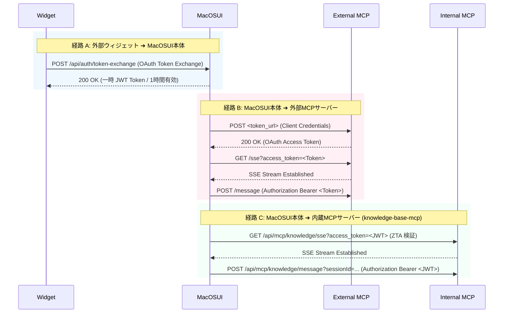

# MacOSUI システム解説・ユーザーガイド (v2.0.0)

本ドキュメントは、AIエージェント・プラットフォーム「MacOSUI」の全体アーキテクチャ、主要な機能、外部連携、セキュリティモデル、およびID管理について、利用者にわかりやすく解説したガイドブックです。

---

## 1. 全体のウィジェットの仕組み

MacOSUIは、デスクトップ上で動作する各アプリを「ウィジェット（AI Agent の顔）」として扱います。

```mermaid
graph TD
    Host[MacOSUI 本体 (React)] <-->|postMessage Bridge| Widget[外部ウィジェット (Iframe)]
    Host <-->|API| Backend[Express バックエンド]
    Backend <-->|Gemini API| Gemini[Gemini 3.5 Flash モデル]
```

* **Iframe サンドボックスによる隔離**:
  外部でホストされたウィジェットは、安全性を担保するため、すべて `<iframe sandbox="allow-scripts allow-same-origin allow-forms">` 内に隔離されて描画されます。これにより、必要な機能を有効（フォーム送信やスクリプト実行など）にしつつ、万が一ウィジェットに悪意のあるコードが含まれていても、MacOSUI本体（親）のDOMやローカルストレージへ直接干渉されるリスクを防ぎます。
* **postMessage 通信ブリッジ**:
  親（MacOSUI）と子（Iframeウィジェット）のデータ連携は、ブラウザ標準の安全な非同期通信 `postMessage` を経由した「非同期通信ブリッジ (SDK)」によって疎結合に制御されます。
* **URLベースの動的インストール**:
  サードパーティ開発者が公開した `skill.json` （マニフェストファイル）のURLを入力するだけで、ビルド不要で即座にウィジェットをDockにインストールして起動できます。

---

## 2. AIエージェント・エンジン：Antigravity ADK

MacOSUIの自律的な動作やエージェント連携は、背後で稼働している **Antigravity ADK (Agent Development Kit)** によって強力に支えされています。

* **自律的プランニングと実行**:
  単に指示されたコマンドを実行するだけでなく、ユーザーの目標（例: 日程調整、複雑なトピックの調査）に向けて、必要なステップを動的に計画し実行する「思考の自律性」を付与します。
* **統一されたツールバインディング**:
  Google カレンダー、ドライブ、Web検索、外部MCPサーバーなどの各種APIやデータリソースを、ADKの標準化された「ツールインターフェース」としてGeminiに透過的かつ安全にバインドします。これにより、モデルは迷うことなく必要な手段を選択できます。
* **マルチエージェント間の協調 (A2A)**:
  ユーザーの「アシスタント」と対話相手の「アシスタント」が、お互いにADKのプロトコルに則ってカレンダー情報やルール設定（就業時間、バッファ）を突き合わせ、人間を介さずに自動で仮調整を行うといった、エージェント間連携を可能にしています。

---

## 3. 各ウィジェットの機能

ユーザーは、おなじみのデスクトップUI（ウィンドウ管理、ドック、メニューバー）を通じて直感的に操作できます。

| ウィジェット名 | 主な機能・役割 |
| :--- | :--- |
| **System Settings** | システム共通のAPIキー、AIモデルの選択、ロールごとの権限（Permissions）、および人事（HR）による就業規則ポリシーの一元管理を行います。 |
| **DmChat (チャット)** | メンバー間でのプライベートメッセージ送信、およびAIアシスタントによる自律的な代理返信と日程調整を行います。 |
| **Virtual Office** | メンバーの現在の状態（部屋：集中ゾーン、会議室、リモートなど）の可視化と、アシスタントの就業ルールの管理を行います。 |
| **External Widgets** | ユーザーがインストールしたサードパーティ製のウィジェットを実行・表示します。 |

* **マルチウィンドウ管理**: 起動したウィジェットは個別のウィンドウとして開かれ、デスクトップ上でのドラッグ移動、自由なリサイズ、重ね合わせが可能です。

---

## 4. AI対応されたウィジェット (AIエージェント機能)

MacOSUIは、常に最新のAIモデルを利用する方針をとっており、現在は **Gemini 3.5 Flash** モデルを採用しています。
API接続には最新の公式SDK (`@google/genai`) を使用し、会話の履歴と文脈をインテリジェントに保持する **ステートフルAPI (Chat/Session API)** を全面的に活用しています。

代表例として、以下のような「日程調整エージェント」が組み込まれています。

* **移動時間を自動考慮した「仮想Busy」**:
  カレンダー上の予定（例: 新宿でアポ、八王子でアポイント）のタイトルや場所から、Geminiが品川を起点とした往路・復路の電車の移動時間を自律的に推測します。この移動時間をカレンダーの元の予定の前後に「仮想Busy」として一時マージした上で、お互いの空き時間を計算します。
* **3段階の日程調整スロット探索**:
  17:30終業・バッファ30分設定の場合、以下の順に賢く枠を探します。
  1. **通常枠 (〜17:00終了まで)**: 終業までの余白を残した状態で終了するスロット。
  2. **就業内バッファ緩和枠 (〜17:30終了まで)**: 就業時間内に収まるギリギリのスロット。「就業終了間際になりますが…」と配慮を添えて提案します。
  3. **時間外枠 (〜18:30終了まで)**: 本日の就業時間内にどうしても空きがない場合、「時間外になりますがBOSSに確認しますか？」と確認を伴う仮登録ボタンを提示します。
* **AI アシスタント自動返答プロンプトのDB化と個人用カスタマイズ**:
  - **デフォルトプロンプトのDB移行**:
    AIアシスタントの基本応答テンプレートは、インラインコードからデータベース（`settings` テーブルの `DEFAULT_ASSISTANT_PROMPT`）へ移行され、システム設定（Admin System Settings）から一元的に更新・管理できるようになりました。
  - **個人カスタマイズと自動フォールバック**:
    各ユーザーは「Virtual Office」のアシスタント調整パネルにて、自分専用のAIプロンプトを登録可能です（個人データは `users.assistant_prompt` に保存されます）。個人用プロンプトが未設定の場合は、自動的にシステム共通のデフォルトプロンプトが適用（フォールバック）されます。
  - **「デフォルトをコピー」機能とタブUIによる編集性向上**:
    設定パネル内は「基本設定」（就業時間やバッファなどのルール設定）と「AIプロンプト」（プロンプトのカスタマイズ）のタブに分割され、プロンプト編集エリア（textarea）が広く見やすくなりました。また、システム標準プロンプトをいつでも閲覧でき、ワンクリックで編集エリアにコピーして改変を始めることができます。
  - **就業規則RAGによる安全審査ハーネス（適合審査）**:
    AIアシスタント用プロンプトをカスタマイズして保存する際、会社の就業規則（データベースの `COMPANY_WORK_POLICY`）に基づき、新プロンプトにコンプライアンス上の違反（深夜アポイントの自動仮登録や、就業時間外アポイントの無条件許容など）がないかを Gemini 2.5 Flash が動的に適合審査します。違反の疑いがある場合は保存を一時的にブロックして具体的な警告理由を通知し、ユーザーが確認・同意した場合のみ `override: true` で強制保存できる二段階保存フローを構築しています。
  - **就業規則の動的変更と権限分離**:
    適合審査の基準となる就業規則（Markdown形式）は、Google Drive等の外部ストレージではなく、System Settings 内の専用タブ「Work Policy」から安全に編集・プレビュー・保存が可能です。この編集機能は、新設された人事（`hr`）ロールまたは `admin` ロールのユーザーのみに解放されており、一般ユーザーや Manager ロールのユーザーはアクセスできません。

---

## 5. 外部連携 (MCP・A2A連携)

MacOSUIは、外部サービスや他のエージェント、および外部ウィジェットと安全に通信するための高度な連携プロトコルと ZTA 認証フローを搭載しています。

### 認証・通信モデル

通信方向や対象に応じて、以下の異なる認証経路が適用されます。



* **Model Context Protocol (MCP) の統合**:
  外部および内蔵の各種機能をGeminiの `tools`（関数呼び出し）に動的に差し込み、AIが状況に応じて自動的に外部の機能やデータを呼び出せるようにする標準仕様です。
* **SSE (Server-Sent Events) トランスポート方式**:
  通信は従来の標準入力（stdio）ではなく、HTTP経由の双方向通信である **SSE（Server-Sent Events）** 方式を採用。`GET /sse` で持続的なストリーム（セッション）を確立し、`POST /message` で安全にメッセージを送受信します。
* **A2A (Agent-to-Agent) 認証とサイレントリフレッシュ**:
  - **外部ウィジェット ➔ 本体**: ユーザー認可に基づき `POST /api/auth/token-exchange` (RFC 8693 Token Exchange) フローによりダウンスコープされた一時的な JWT（Agent Token）を発行します。期限（1時間）が切れた際は、Iframe 内のウィジェットから postMessage 経由でリフレッシュ要求を受け取り、サイレントリフレッシュを実行します。
  - **本体 ➔ 外部MCPサーバー**: 登録された `client_id` と `client_secret` を使用して `token_url` からアクセストークンを取得し、有効期限が切れた場合は自動で再取得して通信を切断させない仕組みを構築しています。
* **内蔵 MCP サーバーの ZTA 保護 (ゼロトラスト適用)**:
  システム内のナレッジベースなどを提供する内蔵 MCP サーバー（`/api/mcp/knowledge`）に対しても、A2Aトークンまたはユーザーセッションの JWT 署名検証を行う `requireAgentOrUserAuth` ミドルウェアが適用されており、認証のない不正なアクセスを厳格に遮断します。

---

## 6. Deep Research ワークフロー定義とナレッジベース

「Deep Research」は、ユーザーが入力した曖昧で複雑な課題について、AIが自律的に多角的な調査を実行し、ドキュメントの生成や成果物の公開までを完全に自動実行（自走化）する高度なAgent機能です。

* **計画（ワークフロー）の自動設計**:
  入力されたテーマに基づき、調査に必要な手順や質問事項を「ワークフロー計画（JSON定義）」として自動設計します。
* **自律調査エンジン**:
  構築されたワークフローに基づき、Web検索やナレッジベース、複数のドキュメントを再帰的に巡回し、情報を深掘りします。
* **成果レポートの自動蓄積**:
  調査が完了すると、自動的にマークダウン形式の構造化された「リサーチ報告書」を作成し、システム内のナレッジベースに即座にインデックス化（RAGの検索対象に自動追加）します。
* **HTML/SVGのHTTPサーバー自動POST配信 (自走化のアウトプット)**:
  生成された成果（レポートやグラフィカルな図表）を他メンバーと即時共有・可視化するため、AIは自律的にHTML（要約Webページ）やSVG（リサーチマップ等の図表）をコード生成し、連携先のHTTPサーバー（Web公開用サーバーなど）の所定のエンドポイントに対して、自動でPOSTアップロードを実行します。これにより、成果物の公開デリバリーまでを一気通貫で処理します。

---

## 7. RAG (Retrieval-Augmented Generation) 機能

AIの回答の正確性を向上させるため、外部のドキュメントを読み込んで検索回答に役立てる「RAG機能」を搭載しています。

* **Google Drive 同期**:
  指定された Google Drive のフォルダから、PDF、プレーンテキスト、Googleドキュメントなどのデータをバックグラウンドで自動同期（`performRagSync`）します。
* **グラウンディングによるハルシネーション（幻覚）防止**:
  同期されたナレッジデータから質問に関連するテキストを自動抽出し、Geminiのプロンプトに「信頼できる根拠」として埋め込んで回答を生成させます。これにより、一般的なWebの知識だけでなく、組織の内部ドキュメントに基づいた正確な回答が可能になります。

---

## 8. ZTA（ゼロトラスト・アーキテクチャ）ベースのセキュリティ

MacOSUIは、システムの防衛ラインとして「ゼロトラスト」の原則を採用しています。

```mermaid
graph LR
    User[ユーザー / ウィジェット] -->|Access Request| PEP[PEP: API Gateway / Middleware]
    PEP <-->|Verify Policies| PDP[PDP: Policy Engine]
    PEP -->|Allow / Block| Target[ターゲットリソース]
    PEP -->|Log Event| Audit[Audit DB (audit_database.sqlite)]
```

* **PDP (Policy Decision Point: 政策決定点)**:
  「誰がどのリソースにアクセスできるか」というルール（ポリシー）を一元的に評価・決定するエンジンです。ユーザーのロールやウィジェットの許可スコープに基づいて認可の可否を決定します。
* **PEP (Policy Enforcement Point: 政策執行点)**:
  バックエンドのAPIゲートウェイや認証用ミドルウェアに位置し、PDPの決定に基づいて不正なリクエストを `403 Forbidden` として遮断（Enforce）する関所です。
* **A2A (Agent-to-Agent) のセキュアな境界防御**:
  ZTA（ゼロトラスト・アーキテクチャ）の実装により、エージェント間の通信は厳格に保護されます。他のエージェントや外部ウィジェットがリクエストを送る際は、明示的な認証トークン（JWT）の検証が義務付けられており、無許可の呼び出しやなりすましを強力にブロックします。
* **監査ログによるセキュリティ強化**:
  誰が・いつ・どのウィジェットから・どのAPIを叩いたか、その認証・アクセスの結果などを `audit_database.sqlite`（監査用データベース）に永続的かつ厳格に即時記録します。これにより、異常なリクエストの検知やアクセス履歴の追跡を可能にし、セキュリティの防衛能力を飛躍的に向上させます。
  特に,AIアシスタントのプロンプト変更時には、就業規則への適合判定（適合 `COMPLIANT` / 違反疑い `SUSPECTED_VIOLATION`）、一時ブロック警告の内容、および変更前・変更後の完全なプロンプトテキストを `policy_compliance` イベントログとしてJSON形式で保存します。これにより、ユーザーが警告を無視して強制的に上書き（Override）した場合でも、変更の意図と結果を詳細に法的にトレース可能です。
  さらに、システム設定変更の API (`POST /api/config`) において、就業規則の更新（`companyWorkPolicy`）とそれ以外のシステム共通設定（APIキー等）の認可チェック（PEP）を分離。就業規則の保存には `action:manage_work_policy` を要求し、他の設定には `action:manage_system_settings` を要求することで、最小権限の原則（Least Privilege）を安全に執行しています。

---

## 9. ID管理 (IDM)

ユーザーやエージェントの身元、および各ロールの権限を詳細に管理します。

* **Google OAuth2 連携**:
  Google アカウントを使用したシングルサインオン (SSO) を採用。アクセストークンや更新トークンを安全に管理し、セッション期間を厳密に制御します。
* **Pod（個人データストア）による隔離と「最小権限の原則」**:
  ユーザーのデータ（カレンダー、ドキュメントなど）は、個別の「Pod（独立したデータストア・隔離空間）」に格納されます。アプリやウィジェットがユーザーのデータにアクセスする際は、事前にPodに対するアクセス認可（Consent）を求める必要があり、要求された「必要最小限の権限（スコープ）」のみが付与されます。これにより、意図しないデータの抜き出しや情報漏洩を強固に防ぎます。
* **複数ロール (Multi-Role) のアサイン**:
  ユーザーに対して `admin`（管理者）、`manager`（マネージャー）、`hr`（人事担当者）、`user`（一般）、`its`（ITサポート）など、複数のロールを同時に割り当てることが可能です。
  - **`manager` ロール**: `action:manage_assistant_rules` 権限を保有し、自身のAIアシスタント予定調整ルールやプロンプトの編集が可能。
  - **`hr` ロール**: `action:manage_work_policy` 権限を保有し、System Settings から就業規則 (Work Policy) の編集・管理のみが可能（APIキーなどのシステム共通設定の変更権限は持たない最小権限設計）。
  - **一般 `user` ロール**: アシスタントルールや就業規則の編集権限は持ちません。
* **きめ細やかな権限管理 (Permissions UI)**:
  System Settings内の「Roles & Permissions」管理画面にて、「特定のロールを持つユーザーに対し、どの外部ウィジェット（例: `Skill: Demo Skill`）の実行を許可するか」をチェックボックスで動的に変更・適用することができます。
